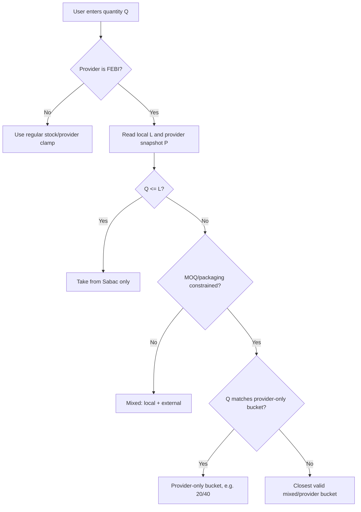
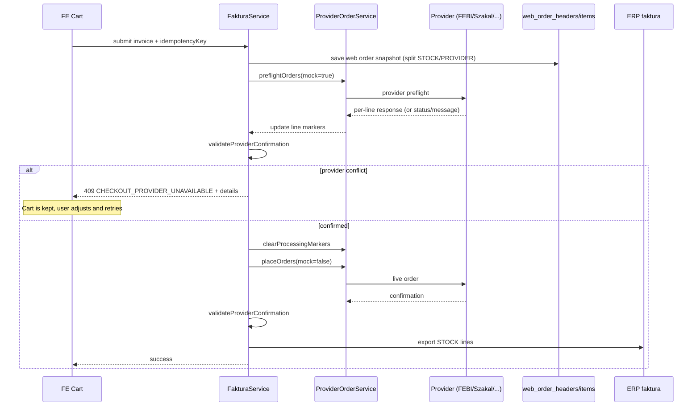
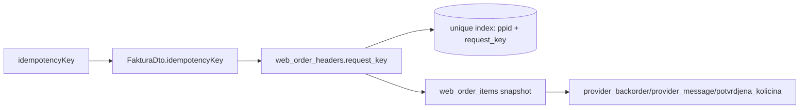

# Provider Routing (Inventory + External Offers)

This system routes inventory/external-offer calls to multiple providers and merges results in a
deterministic, scalable way.

## Quick mental model
- Providers can be **brand-specific** (manufacturer API) or **store-like** (returns many brands).
- Routing is **rules-driven** via YAML (priority, purpose, brands, groups).
- Selection of same article is **availability -> priority -> price**.

## Where rules live
Rules are in `src/main/resources/application.yml`:
```yaml
integration:
  providers:
    rules:
      - provider: febi-stock
        enabled: true
        priority: 100
        purposes: [INVENTORY_ENRICHMENT, EXTERNAL_OFFER]
        brands: [FEBI, BLUE]
      - provider: store-x
        enabled: true
        priority: 50
        purposes: [EXTERNAL_OFFER]
        maxLocalMatchCount: 0
```

## Routing flow (high level)
1) Build `ProviderRoutingContext` (purpose, local counts, groups, partner info).  
2) `ProviderRegistry` filters providers by:
   - capability (enabled + inventory)
   - YAML policy (`ProviderRoutingPolicy`)
   - provider `supports(query, context)`  
3) Providers are **sorted by priority**, then name for determinism.
4) All matching providers are called; results are merged.

Local counts are used to gate providers (e.g. `maxLocalMatchCount`).  
For external offers, counts come from the local results page (total matches + in‑stock count).

## Purpose (when a provider is allowed to run)
`purpose` is a tag for the current flow. If a rule defines `purposes`, the provider is allowed
only for those flows. If you omit `purposes`, the rule applies to all flows.

Current purposes:
- `INVENTORY_ENRICHMENT`: enrich local out-of-stock items with provider availability.
- `EXTERNAL_OFFER`: build external-only offers from TecDoc results.
- `DETAILS`: fetch full provider details (without TecDoc) for a single item.

## Merge/selection policy
If multiple providers return the same article:
1) **Available** beats **not available**.
2) If availability equal: **higher priority wins**.
3) If priority equal: **lower price wins**.
4) If price equal: higher quantity wins (fallback).

## Pricing for external providers
Backend computes the **final customer price** for provider items using:
1) **Base selling price**
   - If `purchasePrice` exists: `purchasePrice * margin`
   - Else: use `sellingPrice` from provider
2) **PDV**: `* 1.20`
3) **Partner multiplier** (from `RobaCeneService`)

Margin is configured in `src/main/resources/application.yml`:
```yaml
pricing:
  margin:
    default-percent: 0.65
    by-group:
      ZAM: 0.30
      AK: 0.30
```
Values are **percent as decimal** (e.g. `0.30` = 30%).
Logic lives in `ProviderPricingService` and is shared by list and details flows.

## Provider ordering (web orders)
This is **separate from the generic routing flow** above. Inventory routing decides availability
and pricing. Ordering is a **per-provider integration** that can be plugged into web orders.

### High-level ordering flow
- Each order item is classified as `STOCK` or `PROVIDER` (local stock vs external).
- **If `STOCK`**: do not send anything to an external provider.
- **If `PROVIDER`**: route by `ProviderAvailabilityDto.provider`.
  - For Febi, the provider key is `febi-stock`.
  - Other providers can implement the same flow with their own integration.

### Febi-specific notes
- Febi ordering is driven by `ProviderAvailabilityDto.provider == "febi-stock"`.
- Price from provider does **not** affect customer pricing; ordering uses quantity + article number.
- Only **production** is allowed to send real orders. Local/dev should use a mock response.
- Simulation is optional; use only if you want a pre-check for availability/backorder.

### Where ordering runs
- Entry point: `FakturaService.submitujFakturu` -> `ProviderOrderService.placeOrders`.
- Orders are grouped by `provider_key` from `WebOrderItem`.
- `ProviderOrderRegistry` resolves the right provider implementation by name.
- The provider returns per-line confirmations; `potvrdjena_kolicina` is updated on the item.
- `WebOrderHeader.extOrderId` is filled when the provider returns an external order id.

### Ordering configuration
Ordering has its own config namespace and is **not** part of routing rules.

Base config (`src/main/resources/application.yml`):
```yaml
integration:
  febi:
    order:
      mode: DISABLED
      base-url: https://bis1.prod.apimanagement.eu20.hana.ondemand.com/p/v1/order-api/api/v1
      customer-order-prefix: "AK AM "
      requested-delivery-offset-days: 0
      simulate-before-create: false
      require-availability: true
      delivery-party: ${FEBI_ORDER_DELIVERY_PARTY:0001001983}
      pickup-delivery-party: ${FEBI_ORDER_PICKUP_DELIVERY_PARTY:0001003023}
      shipping-condition: ${FEBI_ORDER_SHIPPING_CONDITION:S9}
```

Environment defaults:
- `application-local.yml`: `mode: MOCK`
- `application-prod.yml`: `mode: LIVE` (live only when `prod` profile is active)

### New provider ordering checklist
1) Implement `ProviderOrderProvider` and return a stable `providerName()`.
2) Parse order items from `WebOrderItem` (use `provider_key` to match).
3) Map quantity + article number to provider request format.
4) Respect `mock` flag for non-prod or test runs.
5) Return `ProviderOrderResult` with per-line confirmations.
6) Add config under `integration.<provider>.order` (mode, base-url, flags).

### Febi request example (create)
```json
{
  "customer_order": {
    "header": {
      "customer_order_number": "WEB-123456",
      "delivery_party": {
        "partner_code": "0001001983"
      },
      "requested_date_of_delivery": "2024-01-07",
      "shipping_condition": "S9",
      "type": "create"
    },
    "positions": [
      {
        "article_number": "49184",
        "external_order_position": "1",
        "requested_quantity": 2
      },
      {
        "article_number": "22796",
        "external_order_position": "2",
        "requested_quantity": 1
      }
    ]
  }
}
```

### WebOrderItem snapshot
`WebOrderItem` already stores provider availability fields (snapshot) when an order is created:
`provider_key`, `provider_article_number`, `provider_available`, quantities, warehouse, price, etc.
Use this data for audit/traceability; no extra "skipped local stock" status is required.

Order response fields captured on each item:
- `provider_backorder`
- `provider_message`

### Decision table (ordering)
Input signals:
- `itemSource` (STOCK/PROVIDER)
- `providerAvailability.provider`
- `providerAvailability.available`
- `providerAvailability.totalQuantity`
- environment (prod vs non-prod)

Decisions:
- `itemSource == STOCK` -> no provider order
- `itemSource == PROVIDER` and `provider == "febi-stock"` and prod ->
  send create order (simulate optional)
- `itemSource == PROVIDER` and `provider == "febi-stock"` and non-prod ->
  mock create response
- `itemSource == PROVIDER` and provider != "febi-stock" ->
  no order (or other provider integration if available)
- if `available == false` or `totalQuantity == 0` ->
  skip order or treat as backorder based on desired behavior

### ProviderAvailability -> WebOrderItem mapping
When `ProviderAvailabilityDto` exists, the following fields are stored:
- `provider` -> `provider_key`
- `articleNumber` -> `provider_article_number`
- `available` -> `provider_available`
- `totalQuantity` -> `provider_total_quantity`
- `warehouse` -> `provider_warehouse`
- `warehouseName` -> `provider_warehouse_name`
- `warehouseQuantity` -> `provider_warehouse_quantity`
- `purchasePrice` -> `provider_purchase_price`
- `price` -> `provider_price`
- `currency` -> `provider_currency`
- `leadTimeBusinessDays` -> `provider_lead_time_business_days`
- `deliveryToCustomerBusinessDaysMin` -> `provider_delivery_to_customer_days_min`
- `deliveryToCustomerBusinessDaysMax` -> `provider_delivery_to_customer_days_max`
- `nextDispatchCutoff` -> `provider_next_dispatch_cutoff`

## Brand-specific vs store-like providers
### Brand-specific (manufacturer)
- `supportsBrand` should enforce brand list.
- `AvailabilityItem.brand` can be left as the query brand.
- Rule example uses `brands: [FEBI, BLUE]`.

### Store-like (many brands)
- `supports(...)` can ignore brand (or allow `brand == null`).
- **Must set** `AvailabilityItem.brand` from provider response.
- This lets the merge split by brand when brand is requested.

## Provider details (no TecDoc)
If a provider returns full details (name, images, specs), you can bypass TecDoc.
Skeleton is ready:
- `ProviderDetailsProvider` (interface)
- `ProviderDetailsRegistry` (routing + priority)
- `ExternalProviderDetailsService` (maps to `RobaExpandedDto`)

Usage idea:
```java
ProviderDetailsQuery query =
    ProviderDetailsQuery.builder().brand("BOSCH").articleNumber("1234").build();
Optional<RobaExpandedDto> dto =
    externalProviderDetailsService.fetchExternalDetails(query, partner);
```

## How to add a new provider (step by step)
1) **Create the provider class**
   - Implement `InventoryProvider`.
   - Add `@Component` so Spring picks it up.
   - Implement `providerName()`, `capabilities()`, `supportsBrand(...)`.
   - If you need TecDoc brand mapping, implement `resolveBrandKey(...)`.

2) **Map availability correctly**
   - In `checkAvailability`, call the external API and map to:
     - `AvailabilityResult` (provider name, status, destination, items)
     - `AvailabilityItem` (articleNumber, brand, status, warehouses, totalQuantity)
   - If provider returns multiple brands, **set `AvailabilityItem.brand` from response**.
   - Pricing fields:
     - `purchasePrice` = net/nabavna (if you have it)
     - `sellingPrice` = provider selling price (if you have it)
     - `ProviderPricingService` computes final customer price using
       `purchasePrice` + margin + PDV + partner multiplier (fallback to `sellingPrice`).

3) **Add routing rules**
   - Edit `src/main/resources/application.yml` and add:
     ```yaml
     integration:
       providers:
         rules:
           - provider: <providerName>
             enabled: true
             priority: 100
             purposes: [INVENTORY_ENRICHMENT, EXTERNAL_OFFER]
             brands: [BRAND1, BRAND2]   # optional
             groups: [ZAM, AK]         # optional
     ```
   - If you skip rules for a provider, it is allowed by default.

4) **(Optional) External details provider**
   - Implement `ProviderDetailsProvider` and return `ProviderDetailsResult`
     (name, images, specs, numbers, availability).
   - Add a rule with `purposes: [DETAILS]` so routing allows it.
   - Example query:
     ```java
     ProviderDetailsQuery query =
         ProviderDetailsQuery.builder().brand("BOSCH").articleNumber("1234").build();
     externalProviderDetailsService.fetchExternalDetails(query, partner);
     ```

5) **Quick validation**
   - Search an out-of-stock item (so provider availability kicks in).
   - Verify `providerAvailability.provider` + `providerAvailability.price` on FE/response.
   - If multi-brand provider, check that brand-specific filtering still works.

## Files to know
- Routing rules: `src/main/resources/application.yml`
- Policy logic: `src/main/java/com/automaterijal/application/integration/registry/ProviderRoutingPolicy.java`
- Provider registry: `src/main/java/com/automaterijal/application/integration/registry/ProviderRegistry.java`
- Inventory flow merge: `src/main/java/com/automaterijal/application/services/roba/ExternalAvailabilityService.java`
- Context model: `src/main/java/com/automaterijal/application/integration/shared/ProviderRoutingContext.java`
- Provider API: `src/main/java/com/automaterijal/application/integration/shared/InventoryProvider.java`

## 2026-02: Implemented story (FEBI combined quantity + checkout guard)

This section documents what was implemented in BE + FE for the FEBI combined-warehouse story
and the global checkout conflict handling.

### Scope
- FEBI-only combined quantity behavior (`provider == "febi-stock"`):
  - local stock (Magacin Sabac) + external stock (Magacin Beograd/FEBI)
  - special packaging/MOQ handling (`1 -> 20 -> 40`, etc.)
- Checkout conflict blocking for all providers:
  - if provider does not confirm requested quantity, checkout returns `409`
  - cart is kept; user adjusts quantity/removes item and retries
- Idempotent checkout submit via `request_key`.

### FE behavior summary
- Availability and quantity clamp for FEBI combined stock is centralized in:
  - `automaterijal-webshop/src/app/shared/utils/availability-utils.ts`
- Same logic reused in:
  - row, product-card, details, cart-state
- Cart and details can show split by warehouses when request crosses local stock:
  - local part: `Šabac X kom`
  - external part: `Magacin Beograd Y kom` (admin can see explicit FEBI label).

### BE behavior summary
- `FakturaService.submitujFakturu`:
  - splits each line into STOCK and/or PROVIDER allocation
  - saves web order snapshot (including provider fields)
  - preflight provider call
  - validates provider confirmation
  - executes live provider call
  - validates again before ERP stock export
- Conflict payload:
  - throws `CheckoutConflictException` with details object
  - `GlobalControllerAdvice` exposes `details` in HTTP error body.
- Idempotency:
  - `FakturaDto.idempotencyKey` persisted as `web_order_headers.request_key`
  - unique index on `(ppid, request_key)`
  - long keys are normalized to SHA-256 hex (64 chars).

### Quantity decision diagram (FEBI combined)


### Checkout flow diagram (request -> provider -> ERP)


### Data model / persistence diagram


### Manual smoke checklist
- FEBI item with local=1, provider pack=20:
  - quantity steps follow expected bucket progression
  - add-to-cart twice does not lock at wrong max
- Mixed case local+external:
  - cart shows split quantities and delivery hint
- Provider reject/partial confirm:
  - checkout returns conflict
  - cart is not cleared
  - user can reduce/remove and retry in same cart
- Non-FEBI provider:
  - no FEBI combined quantity behavior is applied
  - global conflict handling still works.

### Known caveat (non-blocking)
- Current `ProviderOrderService` has a fallback path for `SUCCESS` without line results.
  If provider message semantics change, classification may need tightening in provider adapters
  (preferred: explicit per-line or explicit call status contracts).
